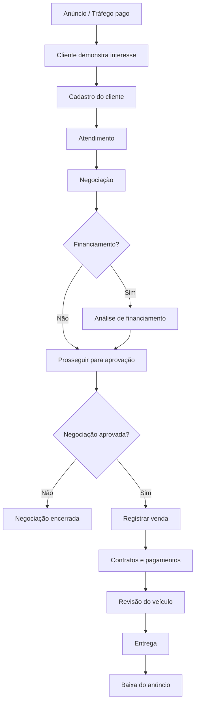
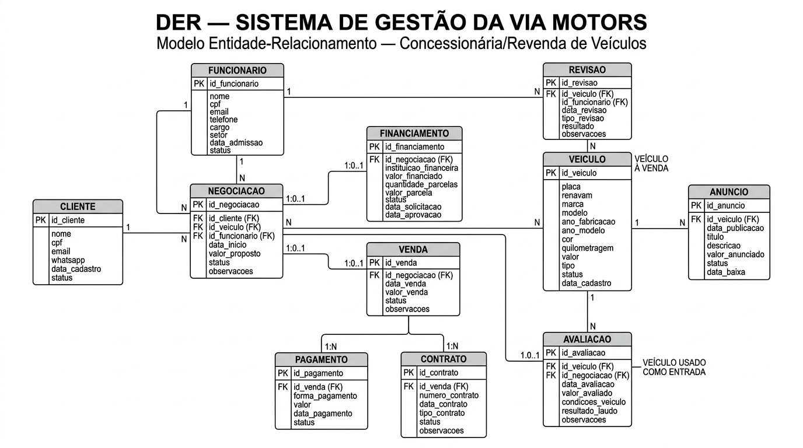

# Entrega 1 — Modelo Conceitual (DER)

## Metadados

**Organização estudada:** Via Motors — revenda/concessionária de veículos

### Integrantes

| Aluno | RGM |
|---|---:|
| André Augusto | 46629963 |
| Lucas Ulisses | 46879412 |
| Eliel Jonathan | 46873457 |
| Gustavo Gomes | 46753061 |
| Pedro Henrique Bispo | 46792619 |

---

## 1. Caracterização da Organização

### Nome e natureza da organização

A organização escolhida para o estudo é a **Via Motors**, uma empresa privada do segmento de **revenda de veículos**, atuando na comercialização de automóveis.

A organização possui **18 anos de atuação no mercado** e conta com aproximadamente **8 pessoas** em sua operação.

### Contexto e porte

A operação está organizada principalmente nos setores de:

- Gerência;
- Vendas;
- Administração;
- Limpeza.

A atividade central da organização é a comercialização de veículos. Para manter a operação funcionando, existem atividades internas e externas.

As atividades externas estão relacionadas principalmente à manutenção da apresentação e das condições dos veículos, incluindo limpeza e manutenção em dia. As atividades internas estão relacionadas à organização administrativa da loja e ao acompanhamento dos processos de atendimento e venda.

### Problemas e necessidades identificados

O levantamento mostrou a necessidade de centralizar as informações relacionadas aos clientes, veículos, anúncios, negociações, financiamentos e vendas.

Também é necessário manter o histórico das operações por segurança da loja e do cliente, permitindo consultar informações de compras e operações anteriores.

Outro ponto importante é o controle do veículo durante todo o processo, desde sua divulgação e negociação até a revisão, venda, entrega e baixa do anúncio.

### Justificativa da escolha

A Via Motors foi escolhida por apresentar processos de negócio suficientemente estruturados para a aplicação dos conceitos de modelagem de dados. O fluxo envolve diferentes informações e etapas, como captação de clientes, atendimento, negociação, financiamento, avaliação de veículo usado, venda, contratos, pagamentos, revisão e entrega.

Esse conjunto de processos permite construir um modelo conceitual com múltiplas entidades e relacionamentos, além de possibilitar futuras expansões do sistema.

### Evidências da organização

Foram consideradas como evidências:

- Registro fotográfico da organização/visita, a ser anexado pelo grupo;
- Site institucional da Via Motors: **viamotorsautomoveis.com.br**;
- Endereço apresentado nos canais da organização: **Av. Professor Luiz Ignácio Anhaia Mello, nº 9121 — Vila União — São Paulo/SP**;
- Telefone apresentado nos canais da organização: **(11) 98315-0115**.

> As fotografias da pesquisa de campo serão adicionadas nesta seção antes da entrega final.

---

## 2. Processos de Negócio

### 2.1 Captação e cadastro de clientes

O primeiro contato normalmente ocorre por meio dos anúncios realizados em tráfego pago. O próprio interessado fornece informações de contato, principalmente **e-mail e WhatsApp**.

Após a entrada do contato, a equipe busca entender o que o cliente procura e quais são suas necessidades para iniciar o atendimento.

### 2.2 Atendimento e negociação

O processo começa com uma conversa para entender o que o cliente deseja. A partir disso, é identificado o veículo de interesse e são discutidas as condições para fechamento do negócio.

A negociação registra o cliente, o veículo, o funcionário responsável, a data de início, o valor proposto e a situação da negociação.

Uma restrição importante é que o cliente **não pode possuir mais de uma negociação simultânea envolvendo financiamento**, pois isso poderia sobrecarregar a análise de crédito realizada pelo banco.

### 2.3 Financiamento

Quando a compra envolve financiamento, a solicitação é relacionada à negociação correspondente. São acompanhados dados como instituição financeira, valor financiado, quantidade de parcelas, valor da parcela e situação da análise.

### 2.4 Veículo usado como entrada

É possível utilizar um veículo usado como parte da entrada de um novo veículo.

O veículo usado é avaliado por profissionais, considerando sua condição e um laudo. O cliente somente deixa o veículo usado na loja no dia em que for retirar o veículo novo.

### 2.5 Venda, contrato e pagamento

Quando a negociação é aprovada, inicia-se a etapa final da operação. Nessa etapa são registrados a venda, os contratos e os pagamentos necessários para formalização do negócio.

### 2.6 Revisão e entrega

Após a venda, o veículo passa por outra revisão antes de ser entregue ao cliente. A revisão registra o resultado da verificação e eventuais observações.

### 2.7 Baixa do anúncio

Quando o veículo é vendido e entregue, é realizada a baixa do anúncio correspondente no sistema, evitando que o veículo continue sendo apresentado como disponível.

### Fluxo geral



---

## 3. Requisitos do Sistema

### 3.1 Requisitos Funcionais

RF01 — Cadastro de clientes

O sistema deve permitir o cadastro de clientes, armazenando as seguintes informações:

* ID do cliente;
* Nome completo;
* CPF;
* E-mail;
* WhatsApp;
* Data de cadastro;
* Status do cadastro.

O CPF deve identificar exclusivamente cada cliente cadastrado.

⸻

RF02 — Consulta e manutenção dos clientes

O sistema deve permitir:

* consultar clientes cadastrados;
* localizar um cliente pelo nome, CPF, e-mail ou WhatsApp;
* visualizar seus dados cadastrais;
* atualizar informações cadastrais;
* alterar o status do cadastro.

O sistema deve preservar o histórico de negociações e vendas relacionadas ao cliente mesmo quando seus dados cadastrais forem atualizados.

⸻

RF03 — Histórico do cliente

O sistema deve permitir consultar o histórico de operações de um cliente, incluindo:

* negociações realizadas;
* veículos relacionados às negociações;
* financiamentos solicitados;
* vendas realizadas;
* informações relacionadas aos pagamentos e contratos.

O histórico deve ser mantido para consulta e segurança da loja e do cliente.

⸻

RF04 — Cadastro de funcionários

O sistema deve permitir cadastrar os funcionários da Via Motors, armazenando:

* ID do funcionário;
* Nome;
* CPF;
* E-mail;
* Telefone;
* Cargo;
* Setor;
* Data de admissão;
* Status.

O setor deve permitir identificar áreas como Gerência, Vendas, Administração e Limpeza.

⸻

RF05 — Cadastro de veículos

O sistema deve permitir cadastrar os veículos disponíveis ou pertencentes ao histórico da loja, armazenando:

* ID do veículo;
* Placa;
* RENAVAM;
* Marca;
* Modelo;
* Ano de fabricação;
* Ano do modelo;
* Cor;
* Quilometragem;
* Valor;
* Tipo do veículo;
* Status;
* Data de cadastro.

O status deve permitir identificar a situação atual do veículo, como disponível, em negociação, vendido ou entregue.

⸻

RF06 — Cadastro e controle de anúncios

O sistema deve permitir cadastrar e controlar anúncios vinculados aos veículos.

Cada anúncio deve armazenar:

* ID do anúncio;
* Veículo anunciado;
* Data de publicação;
* Título;
* Descrição;
* Valor anunciado;
* Status do anúncio;
* Data de baixa.

O sistema deve permitir identificar quais anúncios estão ativos e quais já foram retirados.

⸻

RF07 — Registro de negociação

O sistema deve permitir registrar uma negociação entre um cliente e um veículo, identificando também o funcionário responsável.

A negociação deve armazenar:

* ID da negociação;
* Cliente;
* Veículo de interesse;
* Funcionário responsável;
* Data de início;
* Valor proposto;
* Status da negociação;
* Observações.

⸻

RF08 — Acompanhamento da negociação

O sistema deve permitir acompanhar a situação de cada negociação por meio de seu status.

A negociação poderá representar etapas como:

* em andamento;
* aprovada;
* recusada;
* cancelada.

O sistema deve permitir identificar quais negociações ainda estão em processo e quais foram encerradas.

Regra importante: um cliente não pode possuir mais de uma negociação simultânea envolvendo financiamento.

⸻

RF09 — Registro de financiamento

O sistema deve permitir registrar uma solicitação de financiamento vinculada a uma negociação.

Devem ser armazenadas informações como:

* ID do financiamento;
* Negociação relacionada;
* Instituição financeira;
* Valor financiado;
* Quantidade de parcelas;
* Valor da parcela;
* Status do financiamento;
* Data da solicitação;
* Data da aprovação.

Uma negociação poderá possuir zero ou um financiamento.

⸻

RF10 — Avaliação de veículo usado como entrada

O sistema deve permitir registrar a avaliação de um veículo usado oferecido pelo cliente como parte da entrada de outro veículo.

A avaliação deve armazenar:

* ID da avaliação;
* Veículo usado avaliado;
* Negociação relacionada;
* Data da avaliação;
* Valor avaliado;
* Condições do veículo;
* Resultado do laudo;
* Observações.

O veículo usado oferecido como entrada deve ser identificado separadamente do veículo que o cliente pretende comprar.

⸻

RF11 — Registro da venda

O sistema deve permitir registrar a venda quando uma negociação for aprovada.

A venda deve armazenar:

* ID da venda;
* Negociação relacionada;
* Data da venda;
* Valor final da venda;
* Status da venda;
* Observações.

Uma negociação poderá resultar em zero ou uma venda.

⸻

RF12 — Registro de pagamentos

O sistema deve permitir registrar os pagamentos relacionados a uma venda.

Cada pagamento deve armazenar:

* ID do pagamento;
* Venda relacionada;
* Forma de pagamento;
* Valor pago;
* Data do pagamento;
* Status do pagamento.

Uma venda poderá possuir um ou vários pagamentos.

⸻

RF13 — Registro de contratos

O sistema deve permitir registrar os contratos relacionados à venda.

Cada contrato deve armazenar:

* ID do contrato;
* Venda relacionada;
* Número do contrato;
* Data do contrato;
* Tipo de contrato;
* Status do contrato;
* Observações.

Uma venda poderá possuir um ou vários contratos.

⸻

RF14 — Registro de revisões

O sistema deve permitir registrar as revisões realizadas nos veículos.

Cada revisão deve armazenar:

* ID da revisão;
* Veículo revisado;
* Funcionário responsável;
* Data da revisão;
* Tipo da revisão;
* Resultado;
* Observações.

O registro deve permitir manter o histórico das revisões realizadas em cada veículo.

⸻

RF15 — Controle da entrega do veículo

O sistema deve permitir controlar a conclusão do processo de venda e entrega do veículo por meio dos status da venda e do veículo.

Antes da entrega, o veículo deve passar pela revisão correspondente.

Após a conclusão do processo, o sistema deve permitir identificar que o veículo foi vendido e entregue.

⸻

RF16 — Baixa do anúncio após a venda

O sistema deve permitir realizar a baixa do anúncio quando o veículo for vendido e entregue.

Ao realizar a baixa, devem ser registrados:

* Status do anúncio;
* Data de baixa.

O anúncio baixado não deve permanecer como uma oferta ativa de um veículo disponível para venda.

⸻

Por que essa versão é melhor?

Agora existe uma ligação muito mais clara:

Requisito → Entidade → Atributos → Regra de negócio → DER

Por exemplo:

RF01: cadastrar cliente
↓
Cliente
↓
id_cliente, nome, cpf, email, whatsapp, data_cadastro, status
↓
CPF único
↓
aparece no DER como atributo da entidade Cliente.

Isso é exatamente o tipo de consistência que queremos manter entre as partes do trabalho.

E eu faria a mesma melhoria nas outras seções

Principalmente:

* 3.2 Requisitos Não Funcionais
* 4. Regras de Negócio
* 5. Dicionário de Dados

Porque agora que detalhamos os requisitos, precisamos conferir se cada atributo que aparece aqui existe no dicionário e no DER.

Não precisamos refazer o projeto. É uma melhoria de documentação e consistência.

### 3.2 Requisitos Não Funcionais

**RNF01 — Segurança:** os dados cadastrais e históricos devem possuir controle de acesso adequado.

**RNF02 — Privacidade:** informações pessoais, como CPF e contatos, devem ser protegidas e utilizadas somente para as finalidades do sistema.

**RNF03 — Integridade:** o sistema deve impedir referências para clientes, funcionários, veículos ou vendas inexistentes.

**RNF04 — Consistência:** os status das entidades devem representar corretamente a etapa do processo.

**RNF05 — Usabilidade:** as telas devem permitir que os funcionários encontrem rapidamente clientes, veículos, negociações e vendas.

**RNF06 — Disponibilidade:** os dados devem permanecer disponíveis para consulta durante a operação da loja.

**RNF07 — Escalabilidade:** o modelo deve permitir a inclusão futura de novos recursos sem necessidade de reconstrução completa da estrutura de dados.

---

## 4. Regras de Negócio

### Regras operacionais

**RN01.** Todo cliente deve possuir cadastro antes de ter uma negociação registrada.

**RN02.** Uma negociação deve estar vinculada a um único cliente, um único veículo de interesse e um funcionário responsável.

**RN03.** Um cliente pode possuir várias negociações ao longo do tempo.

**RN04.** Um cliente não pode possuir mais de uma negociação simultânea envolvendo financiamento.

**RN05.** Uma negociação pode ou não possuir financiamento.

**RN06.** Uma negociação somente pode originar uma venda quando estiver aprovada.

**RN07.** Uma venda deve estar vinculada a uma negociação.

**RN08.** Uma venda pode possuir um ou mais pagamentos.

**RN09.** Uma venda deve possuir os contratos necessários para sua formalização.

**RN10.** Um veículo usado oferecido como entrada deve passar por avaliação.

**RN11.** O veículo usado como entrada é diferente do veículo que o cliente pretende comprar.

**RN12.** O veículo usado somente é deixado na loja no momento da retirada do veículo novo.

**RN13.** O veículo vendido deve passar por revisão antes da entrega.

**RN14.** O anúncio do veículo deve ser baixado após a venda e entrega.

**RN15.** O histórico das operações deve ser mantido para segurança da loja e do cliente.

### Restrições organizacionais

**RO01.** O processo de financiamento deve respeitar a limitação operacional de uma negociação financiada simultânea por cliente.

**RO02.** A avaliação de veículo usado deve considerar suas condições e laudo realizado por profissional.

**RO03.** O controle do estoque e dos anúncios deve refletir a situação real dos veículos.

**RO04.** A revisão anterior à entrega funciona como uma etapa de conferência do veículo antes de sua disponibilização ao cliente.

---

## 5. Dicionário de Dados Conceitual (Preliminar)

O dicionário completo foi organizado em arquivo HTML separado, conforme solicitado pela estrutura da entrega.

**Arquivo:** `Dicionario_de_Dados_Via_Motors.html`

As entidades modeladas são:

1. Cliente
2. Funcionario
3. Veiculo
4. Negociacao
5. Financiamento
6. Venda
7. Pagamento
8. Contrato
9. Avaliacao
10. Revisao
11. Anuncio

> Os atributos, descrições, PKs, FKs e regras de cada entidade estão detalhados no arquivo HTML do dicionário.

---

## 6. Modelagem Conceitual (Entidades, Atributos, Relacionamentos)

### Entidades reconhecidas

- **Cliente:** representa as pessoas interessadas ou envolvidas na compra de veículos.
- **Funcionario:** representa os colaboradores envolvidos no atendimento, negociação e acompanhamento dos processos.
- **Veiculo:** representa os automóveis controlados pela organização.
- **Negociacao:** representa o processo de negociação entre cliente, funcionário e veículo.
- **Financiamento:** representa a solicitação de crédito relacionada a uma negociação.
- **Venda:** representa a conclusão comercial de uma negociação aprovada.
- **Pagamento:** representa os pagamentos associados à venda.
- **Contrato:** representa a formalização documental da venda.
- **Avaliacao:** representa a avaliação de um veículo usado oferecido como entrada.
- **Revisao:** representa a verificação realizada no veículo antes da entrega.
- **Anuncio:** representa a divulgação de um veículo disponível.

### Relacionamentos

| Relacionamento | Cardinalidade | Interpretação |
|---|---|---|
| Cliente — Negociacao | 1:N | Um cliente pode ter várias negociações ao longo do tempo. |
| Funcionario — Negociacao | 1:N | Um funcionário pode acompanhar várias negociações. |
| Veiculo — Negociacao | 1:N | Um veículo pode participar de negociações ao longo de seu histórico. |
| Negociacao — Financiamento | 1:0..1 | Uma negociação pode não ter financiamento ou possuir um. |
| Negociacao — Venda | 1:0..1 | Uma negociação pode não resultar em venda ou resultar em uma. |
| Venda — Pagamento | 1:N | Uma venda pode possuir um ou mais pagamentos. |
| Venda — Contrato | 1:N | Uma venda pode possuir um ou mais contratos. |
| Veiculo — Anuncio | 1:N | Um veículo pode possuir anúncios ao longo do histórico. |
| Veiculo — Revisao | 1:N | Um veículo pode passar por várias revisões. |
| Funcionario — Revisao | 1:N | Um funcionário pode acompanhar várias revisões. |
| Negociacao — Avaliacao | 1:0..1 | Uma negociação pode não ter avaliação ou ter uma quando houver veículo de entrada. |
| Veiculo — Avaliacao | 1:N | Um veículo pode passar por avaliações ao longo do histórico. |

### Restrições aplicadas ao modelo

O modelo diferencia o **veículo de interesse da negociação** do **veículo usado oferecido como entrada**. Essa distinção é necessária porque são automóveis que desempenham papéis diferentes dentro da mesma operação.

Também foi mantida a separação entre **negociação** e **venda**, pois uma negociação pode ser encerrada sem gerar venda.

---

## 7. Diagrama Entidade-Relacionamento (DER)

O DER completo está anexado separadamente ao repositório:

**`DER_Via_Motors.jpg`**



O diagrama apresenta as 11 entidades, seus atributos, chaves primárias, chaves estrangeiras, relacionamentos e cardinalidades.

O modelo foi estruturado para permitir futuras extensões, como novos processos comerciais, formas de pagamento, instituições financeiras, controle de estoque e integrações com outros sistemas.

---

## 8. Justificativa Técnica

A modelagem foi construída a partir dos processos identificados na organização e busca separar responsabilidades para evitar concentração excessiva de informações em uma única entidade.

A entidade **Cliente** foi separada de **Negociacao** porque um mesmo cliente pode realizar diferentes negociações ao longo de seu histórico.

A entidade **Veiculo** foi mantida independente porque o automóvel possui informações próprias e participa de diferentes processos, como anúncio, negociação, avaliação e revisão.

A separação entre **Negociacao** e **Venda** representa corretamente o processo observado: primeiro ocorre a negociação e, somente após sua aprovação, são realizados os procedimentos finais da venda.

**Financiamento** foi modelado separadamente porque é uma etapa opcional da negociação e possui informações próprias, como instituição financeira, valor financiado, parcelas e situação da análise.

**Pagamento** e **Contrato** também foram separados da venda para permitir o registro de múltiplos pagamentos e diferentes documentos relacionados à formalização da operação.

A entidade **Avaliacao** foi criada para representar especificamente a análise do veículo usado oferecido como entrada. Seu relacionamento com **Veiculo** e **Negociacao** permite distinguir o automóvel usado entregue como entrada daquele que está sendo adquirido.

A entidade **Revisao** permite manter o histórico das verificações realizadas nos veículos, especialmente antes da entrega.

Por fim, **Anuncio** foi separado de **Veiculo** porque a divulgação possui ciclo próprio: pode estar ativa durante a disponibilidade do automóvel e ser baixada após a venda e entrega.

As cardinalidades foram definidas para representar a possibilidade de histórico sem perder as restrições do processo. Dessa forma, o modelo consegue representar operações passadas e também servir como base para futuras etapas de implementação.

---

## 9. Uso de Inteligência Artificial

O grupo utilizou ferramentas de Inteligência Artificial como apoio à organização e revisão do trabalho. A IA foi utilizada como ferramenta auxiliar, enquanto as informações específicas da organização foram baseadas no levantamento realizado junto à Via Motors.

### Uso 1 — ChatGPT

| Item | Registro |
|---|---|
| **Ferramenta e etapa** | ChatGPT — organização dos requisitos, regras de negócio, dicionário de dados, modelagem e revisão do README. |
| **Motivação** | Auxiliar na organização das informações coletadas e na transformação dos processos observados em uma estrutura adequada para modelagem de banco de dados. |
| **Prompt(s) utilizados** | “analise o documento da entrega e crie as perguntas para meu grupo fazer a concessionaria que escolhemos”;“Pegar exatamente essas informações da Via Motors e montar a estrutura para a entrega”; “Faça uma auditoria do modelo”; “Montar o prompt com base nas informações para criarmos a imagem visual do DER”. |
| **Resposta recebida** | A IA auxiliou na identificação das seções da entrega, organização dos processos, definição de entidades, atributos, relacionamentos e cardinalidades e revisão da consistência do modelo. |
| **Fontes consultadas e verificadas** | As informações específicas sobre a Via Motors foram comparadas com as informações obtidas no levantamento de campo e com as evidências disponíveis da organização. |
| **Trechos rejeitados ou corrigidos** | Foram revisadas principalmente cardinalidades e a representação do veículo usado como entrada, para evitar confundi-lo com o veículo que está sendo comprado. |
| **Justificativa da escolha final** | O grupo manteve as sugestões que estavam coerentes com os processos levantados e ajustou os pontos necessários para manter consistência entre requisitos, regras, dicionário e DER. |
| **Reflexão crítica** | A IA pode propor estruturas genéricas que não correspondem exatamente à realidade de uma organização. Por isso, as informações específicas foram confrontadas com o levantamento realizado e as decisões finais foram revisadas pelo grupo. |

### Uso 2 — Gemini

| Item | Registro |
|---|---|
| **Ferramenta e etapa** | Gemini — geração visual do DER. |
| **Motivação** | Produzir uma representação visual organizada do modelo conceitual para anexação à entrega. |
| **Prompt(s) utilizados** | Foi fornecido um prompt detalhado contendo as 11 entidades, atributos, PKs, FKs, relacionamentos, cardinalidades e regras de negócio do modelo. |
| **Resposta recebida** | O Gemini gerou o diagrama visual com as entidades, atributos e relacionamentos especificados. |
| **Fontes consultadas e verificadas** | O conteúdo do diagrama foi conferido com o modelo desenvolvido pelo grupo. |
| **Trechos rejeitados ou corrigidos** | A representação foi revisada para conferir principalmente as cardinalidades e a distinção entre veículo comprado e veículo usado como entrada. |
| **Justificativa da escolha final** | A imagem foi mantida por apresentar as entidades e informações do modelo de forma visualmente organizada e adequada para anexação ao README. |
| **Reflexão crítica** | Ferramentas de geração de imagens podem alterar ou omitir textos e relacionamentos. Por isso, o DER gerado foi revisado visualmente antes de ser considerado como versão final. |

---

## Evidências

As fotos da pesquisa de campo serão adicionadas pelo grupo nesta seção ou em uma pasta `evidencias/` do repositório.

Sugestão de organização:

```text
/
├── README.md
├── DER_Via_Motors.jpg
├── Dicionario_de_Dados_Via_Motors.html
└── evidencias/
    ├── visita_01.jpg
    ├── visita_02.jpg
    └── ...
```

---

## Entrega final

De acordo com o roteiro, a entrega final deve conter:

- `README.md` completo;
- DER em imagem;
- Dicionário de Dados em HTML;
- Evidências da organização/pesquisa de campo;
- Arquivos anexados ao repositório GitHub do grupo.

